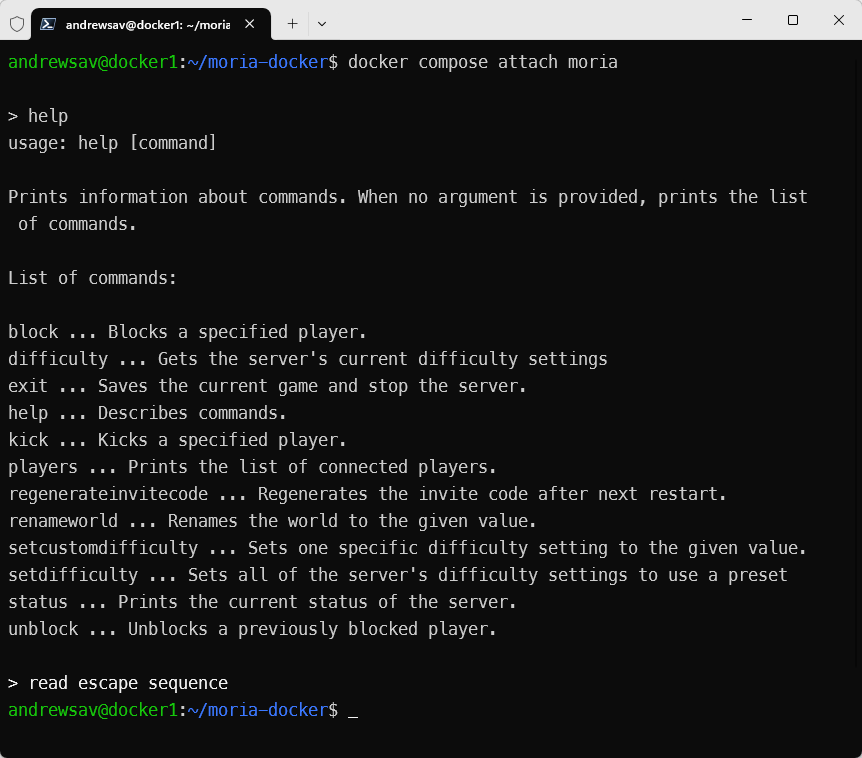

# Dockerized Return to Moria dedicated server in an Ubuntu 24.04 container with Wine

[](https://github.com/AndrewSav/moria-docker/actions)
[](https://hub.docker.com/r/andrewsav/moria/tags)

This is not an official project and I'm not affiliated with developers or publishers of the game. Head to https://www.returntomoria.com/news-updates/dedicated-server for official information / FAQ. Join the game Discord server at https://www.returntomoria.com/community to get help. This image is versioned separately and the image version is not in sync with either the game or the dedicated server.

Checked that it's working with [1.6.7](https://www.returntomoria.com/news-updates/patch-1-6-7-release-notes) on 21 February 2026.

## Environment variables


| Variable    | Description                                                  |
| ----------- | ------------------------------------------------------------ |
| SKIP_UPDATE | if provided, skips the Steam update process on container startup |
| SERVER_WORKER_THREADS | See [here](https://www.returntomoria.com/news-updates/patch-1-6-7-release-notes) for the details. Sets `-NumServerWorkerThreads`. Defaults to 4. If provided, can lower the default |
| PUID | UID to run the server process as. Defaults to 1000. Set this to match your host user UID if you want to conveniently access the `./server` files (configs, saves, logs) on the host without `sudo`. The container operates correctly regardless. See `On accessing server files without sudo` below for more details |
| PGID | GID to run the server process as. Defaults to 1000. Same as above but for group |

## Ports


| Exposed Container port | Type |
| ------------------------ | ------ |
| 7777                | UDP  |

In order for others to connect to your server you will most likely need to configure port forwarding on your router.

## Volumes


| Volume             | Container path              | Description                             |
| -------------------- | ----------------------------- | ----------------------------------------- |
| Steam install path | /server   | the server files are downloaded into this directory, and settings files are created here on the first start. server logs and saves are located under /server/Moria/Saved |
| Wine prefix | /wineprefix-volume | Used when `PUID` is not `1000`. See `On accessing server files without sudo` below for more details |

## Starting the server

In the folder containing `docker-compose.yml` run

```bash
docker compose up -d --force-recreate
```

You can watch the logs with:

```bash
docker compose logs -f
```

*Note: this readme assumes that you are using the supplied `docker-compose.yml` to start the server. Some parts of this readme may be inaccurate if your settings differ from the provided.*

## Accessing server console

To attach to the console run:

```
docker compose attach moria
```

Then hit `enter` once or twice.

To detach, press:

```
CTRL+p CTRL+q
```

This may or may not work depending on your terminal, and on whether or not you are using `ssh`. It worked for me in most scenarios.



*Technical note: this docker image patches the dedicated server executable [windows subsystem](https://learn.microsoft.com/en-us/windows/win32/debug/pe-format#windows-subsystem) from GUI (2) to CUI (3) in order to provide access to the server console*

## Server configuration

Once the server has fully started for the first time it will copy the default server settings to `./server/MoriaServerConfig.ini`, `./server/MoriaServerPermissions.txt`, `./server/MoriaServerRules.txt` files.

Edit the files to your liking and restart the containers:

```bash
docker compose up -d --force-recreate
```

Logs are found in `./server/Moria/Saved/Logs/` directory, and Saves are in `./server/Moria/Saved/SaveGamesDedicated/` directory.

You can now connect to your server from the game (provided that the port forwarding is set up correctly).

*Note: read the official notes linked at the top of this README. They will tell you how to set up a password, copy the game world from your single player playthrough and more*

In order to convert the server world to Durin's Folk expansion, add these lines to `./server/MoriaServerConfig.ini` at the bottom of the `[World.Create]` section:

```ini
; Comma separated list of DLCs enabled which will be used when creating a new world.
; Once DLC is enabled for a world, it cannot be disabled.
; "DLC1,DLC2,DLC3" etc
; By default this will always be populated with every possible DLC
; If you wish to create new worlds with all possible DLCs enabled, leave this with default values.
OptionalDLC.Array="DurinsFolk"

; Comma separated list of DLCs to apply when upgrading worlds without them.
; By default this will always be empty as upgraded worlds cannot go back.
; Most commonly used when loading old worlds after new DLC content is released.
; If you wish to upgrade your existing worlds to new DLC content please fill this in with OptionalDLC values above.
UpgradeOptionalDLC.Array="DurinsFolk"
```

Once the server is converted to the expansion, players that do not have the expansion will no longer be able to join. This change is irreversible, so make a backup if in doubt.

## Connecting to the server

In game, after clicking "Join Other World", select "Advanced Join options". Use "Direct Join" section. Enter the server IP or domain name and the port number in the format prompted on that screen, and enter password if any. Click Join Server. You can also join via an invite code. The invite code is dumped in the container log; you can search for it with `docker compose logs | grep Invite` after the server has completed startup.

## Updating the server

Restart the container. It will check Steam for a newer server version on start and update if required. My preferred method of restarting is running `docker compose up -d --force-recreate` but simple `docker restart moria` would suffice.

## Additional Information

### Changing port

If you change port in `docker-compose.yml` from `7777` to something else, e.g.:

```yaml
    ports:
      - '12345:7777/udp'
```

You will also need to update `MoriaServerConfig.ini` accordingly:

```ini
AdvertisePort=12345
```

### Port forwarding

Detailed port forwarding guide is out of scope of this document, there are a lot of variations between routers in how this is done. However, here are a few important points to keep in mind:

- You need to forward port `7777` (unless you changed it to something else) on UDP protocol. Without this your server won't be accessible from the internet. You can use <https://mcheck.bat.nz/> to check if your server is accessible.
- It is possible that the server is accessible from the internet but not from the same (home) network where your server is in. This is called a hairpin NAT problem. Either google how to configure it on your router (if it supports it), or use local IP address for connecting to the server within the same network (as opposed to your external IP address).
- Some internet providers employ [CGNAT](https://en.wikipedia.org/wiki/Carrier-grade_NAT). If yours does, you won't be able to make your server accessible externally, unless you and other users use a VPN or a tunneling service such as <https://playit.gg/> (this is not an endorsement, I have never used this service myself).

### Editing `MoriaServerConfig.ini`

There are a couple of things that can break this docker image, if you edit them in `MoriaServerConfig.ini`, so please be aware:

- `docker-compose.yml` and the docker image health check, expect the server port to be `7777`. You can easily change the mapped port to any value you want in `docker-compose.yml` (e.g. to change port to `12345` use `12345:7777/udp`) which will work, but if you change `ListenPort` in `MoriaServerConfig.ini` it will break both `docker-compose.yml` and the health check. I cannot think of a case where the internal container port needs changing, since changing the external container port is so easy, but if you must, you will have to make the adjustments to both `docker-compose.yml` and `Dockerfile` and rebuild the image.
- If you change the `[Console]` section from the default of `Enabled=true`, graceful termination and attaching to the console will stop working. The former because nothing can process `SIGINT` any more, and the latter because there is no console to attach to any longer. When graceful termination is not working, when you restart or down your container, the online session is not cleaned up which will prevent the server from starting until the session expires, which can take around 5 minutes

### On accessing server files without sudo

When running a container as non-root, the file ownership outside of the container is the same as inside, `PUID=1000` by default. If your logged on user has a different PUID (e.g. 1001), you won't be able to modify the server files (such as `MoriaServerConfig.ini` or save files) without `sudo`. If that's fine by you, or if you are normally working as `root` anyway, you can skip the rest of this section. You can set up PUID/PGID in the container to match your user to work around this issue, allowing you to access the server files directly. In `docker-compose.yml` uncomment all the commented out lines below:

```yaml
    #environment:
    #  - PUID=1001
    #  - PGID=1001
    volumes:
      - './server:/server'
    #  - './wineprefix:/wineprefix-volume'    
```

Set PUID and PGID to match your user's UID and GID. You can find those out by running the `id` command.

The rest of this section explains why we need the volume when PUID and PGID have non-default values; it is not necessary to know this to operate the container.

The wine prefix is a directory containing the Windows runtime environment wine uses to run the server. It is built into the image at build time, owned by uid 1000. When a different `PUID` is used, the container needs to `chown` those files to the new uid before starting the server. Docker uses an overlay filesystem: the image layers are read-only, and any modifications (including ownership changes) are written to a thin writable layer on top. Changing ownership of thousands of files in the wine prefix causes each of them to be copied from the read-only image layer into the writable layer — this is the copy-on-write cost, and it makes startup noticeably slow. By placing the wine prefix on a bind mount (a real directory on the host filesystem) instead, there is no overlay involved and `chown` is fast. The copy from the image to the bind mount only happens once on first start; subsequent starts just run `chown` against the already-copied files on the host filesystem.

The wine prefix is built into the image at `/wineprefix-template`. At container startup it is made available to wine at `/home/steam/.wine` via a symlink or copy, depending on `PUID`:

- **`PUID=1000` (default):** A symlink is created from `/home/steam/.wine` to `/wineprefix-template` in the image. No files are copied and no ownership changes are needed, so startup is fast.
- **`PUID` other than `1000`:** On the first start the prefix is copied to the `./wineprefix` bind mount and ownership is set to the specified `PUID`/`PGID`. This one-time copy is the slow path. On subsequent starts only `chown` is run against the bind mount (fast, since it is a real filesystem with no copy-on-write overhead), and a symlink is created as above.

A `.timestamp` file inside `./wineprefix` records the build timestamp of the image the volume was populated from. On each start this is compared against the timestamp baked into the image — if they differ (first run or image upgrade), the volume is cleared and re-copied from the new template.

### Bind mounts vs volumes

There are three ways to persist data for a Docker container:

- Bind-mount, where you map a path outside of the container to a path inside the container
- Volume mount, where you create a Docker volume and map that volume to a path inside the container
- Anonymous volume, where you get docker to auto-create the volume for you and map it to a path inside the container

I personally prefer the first option (this is the option showcased in the supplied `docker-compose.yml`), because it makes everything explicit. If I delete the game folder, all the game data is gone too, it does not hang around in a volume that is not directly visible, or worse an anonymous volume I won't be able to remember which it was for later. However, some people have different preferences and all three ways will work, in particular, both volumes this container intends to use are specified in the `Dockerfile`, so an anonymous volume will be created if a user does not specify another option manually. If you use the other two options, I trust in your ability to adjust what's written on this page to your custom setup.

### Patcher

The [patcher](patcher) folder contains a patcher used by the image in order to make attaching to the console possible. It changes a single byte in the game server executable. Naturally, during container startup, when Steam verifies the integrity of the files the patch would be detected and some time would be spent on the "repair". To avoid that, before the integrity check a backup of the unpatched executable kept in `server/Moria/Binaries/Win64/MoriaServer-Win64-Shipping.bak` is moved over the patched executable before the verification. After verification/update the executable is patched again (and the backup is taken) before the server starts.

### Health check

The [healthcheck](healthcheck) folder contains a utility, which sends a UDP message to the server and checks if it receives a response. If no response is received the health check is assumed to fail. Please refer to the `HEALTHCHECK` directive in `Dockerfile` to see how the health check is configured. This can be overridden in your `docker-compose.yml` if desired.

By and large the health check does not change how the image works. When you do `docker compose ps` or `docker ps` you will be able to see the health check result of the most recent health check. If you run `docker inspect --format='{{json .State.Health}}' moria | jq` (assuming you have `jq` installed), you will see the last few entries of health check log.

I've added the health check, because the server cannot function and shuts down if the connection to Epic Online Services goes down. When this was added, the community were seeing this happening quite often (several times a week). It seems to have improved somewhat with time, but maintenance downtime is still regular. When this happens, all the Moria servers no longer work, until EOS goes back up again.

Docker does not have a facility to restart unhealthy containers, but there are external solutions that can achieve the same. This is not an endorsement of any of the below.

- https://github.com/willfarrell/docker-autoheal - restarts unhealthy containers
- https://github.com/petersem/monocker - sends a notification on container change status

## About this docker image

See [APPROACH.md](APPROACH.md)

## Credits

- https://github.com/Theogalh/ReturnToMoriaServerOnLinuxTutorial
